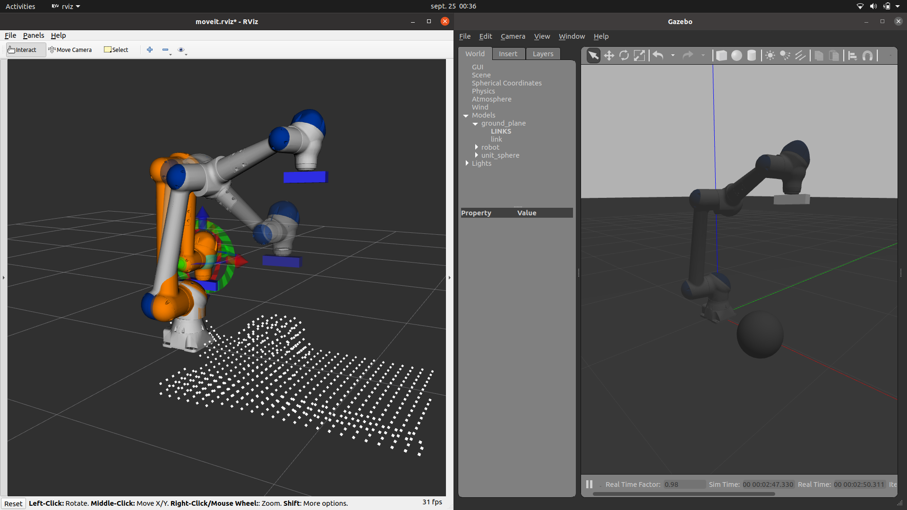
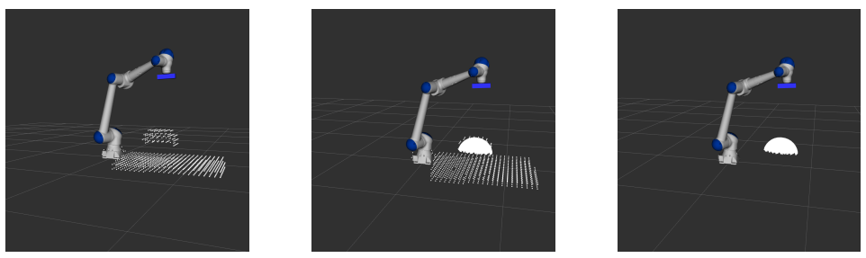
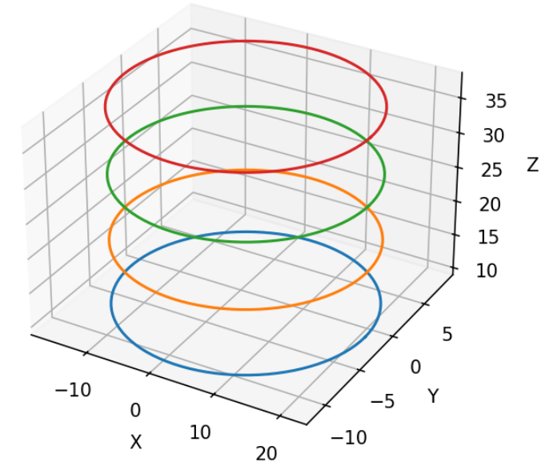
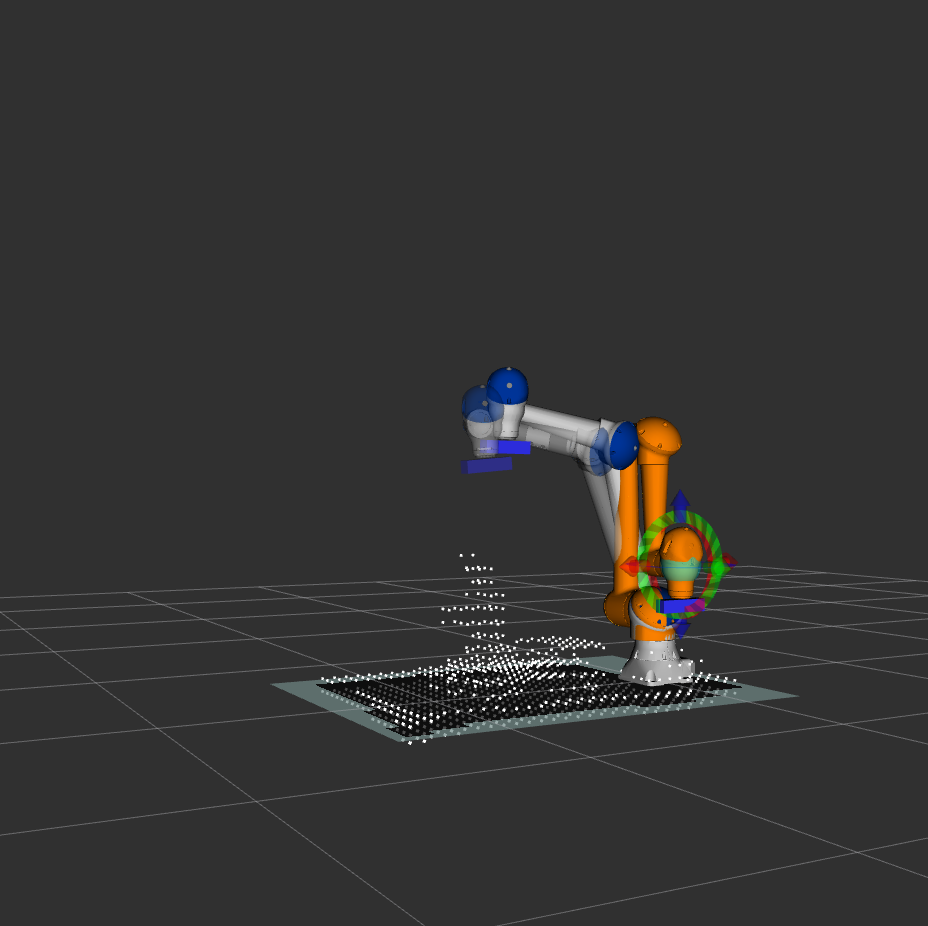

# 🤖 Robotic Trajectory Planning — Yaskawa HC10 + Kinect 3D

> **Academic project** — UPSSITECH, Université Paul Sabatier Toulouse III  
> Specialization: Robotics & Interactive Systems (SRI)  
> Team project — 9 engineers

---

## 🎯 Overview

This project develops an **autonomous trajectory planning system** for the **Yaskawa HC10** industrial manipulator arm, enabling it to perform 3D scanning of unknown objects using a **Kinect depth sensor** in a simulated ROS/Gazebo environment.

The robot autonomously:
1. Detects and segments the target object from 3D point cloud data
2. Computes an **adaptive elliptical trajectory** around the object
3. Maintains camera orientation toward the object throughout the scan
4. Avoids collisions using a real-time **OctoMap occupancy grid**

---

## 📸 Demo & Results

### Simulation Environment (RViz + Gazebo)

*Left: RViz visualization with point cloud — Right: Gazebo physics simulation*

### 3D Point Cloud Filtering

*Raw point cloud (left) → Ground plane removed → Filtered object cloud published on `/camera/depth/points_black`*

### Elliptical Trajectory Generation

*Multi-layer elliptical trajectory adapting to object height — each layer is a scan revolution*

### Final Scan Result — Kuka YouBot

*3D model reconstructed via OctoMap after full scanning sequence*

### Trajectory Accuracy

*Target vs. realized trajectory — Max position error: **5×10⁻² mm** | Max orientation error: **8×10⁻² rad***

---

## 🏗️ System Architecture

```
┌─────────────────────────────────────────────────────┐
│                  Kinect Sensor (Gazebo)              │
│         RGB: /camera/color/image_raw                 │
│         Depth: /camera/depth/image_raw               │
│         Point Cloud: /camera/depth/points            │
└──────────────────────┬──────────────────────────────┘
                       │
                       ▼
┌─────────────────────────────────────────────────────┐
│           Point Cloud Processing (Python)            │
│  • Ground plane detection & removal                  │
│  • Normal estimation & clustering                    │
│  • Output: /camera/depth/points_black                │
└──────────────────────┬──────────────────────────────┘
                       │
                       ▼
┌─────────────────────────────────────────────────────┐
│         Elliptical Trajectory Computation            │
│  • Object bounding box from point cloud              │
│  • Semi-axes: a = dist_x + ε, b = dist_y + ε        │
│  • Multi-layer: 1 layer per 10 units height          │
│  • Scale factor: 1.38 (collision safety margin)      │
└──────────────────────┬──────────────────────────────┘
                       │
                       ▼
┌─────────────────────────────────────────────────────┐
│         Quaternion Orientation Control               │
│  • Camera always pointing toward object center       │
│  • θ = arccos(Z · d), δ = Z × d                     │
└──────────────────────┬──────────────────────────────┘
                       │
                       ▼
┌─────────────────────────────────────────────────────┐
│              MoveIt API (Python)                     │
│  • Cartesian space goal poses (no joint conversion)  │
│  • Collision-aware planning via OctoMap              │
│  • Execution in Gazebo simulation                    │
└─────────────────────────────────────────────────────┘
```

---

## 🔬 Technical Highlights

### Point Cloud Filtering
Ground plane removal using **normal vector clustering**:
- Compute normals for each point relative to point cloud center
- Identify ground plane as the majority plane farthest from center
- Filter threshold: `s = 0.196 × |max_z − min_z|`

### Trajectory Generation
Adaptive elliptical path computed from object geometry:
```
a = dist_x + ε          # semi-axis X
b = dist_y + ε          # semi-axis Y  
x = C.x + a·cos(t)·scale
y = C.y + b·sin(t)·scale
z = (1-t)·(act_pose.z − minZ − threshold)
```
with `scale = 1.38`, `ε = 0.12`, `t ∈ [0, 2π]`

### Camera Orientation (Quaternion)
```
θ = arccos(Z · d)
δ = Z × d
where d = (C − position) / ‖C − position‖
```

### OctoMap Integration
Real-time 3D occupancy map from point cloud → MoveIt collision avoidance during trajectory execution.

---

## 🛠️ Tech Stack

| Category | Technology |
|---|---|
| Robot Framework | ROS Noetic |
| Motion Planning | MoveIt + KDL solver |
| Simulation | Gazebo, RViz |
| 3D Sensor | Kinect (RGB-D) |
| Occupancy Mapping | OctoMap |
| Robot Model | Yaskawa HC10 (URDF/xacro) |
| Language | Python 3 |
| OS | Ubuntu 20.04 |

---

## 📁 Project Structure

The project is organized as a multi-package ROS workspace:

```
integration_ros_hc10_kinect/
├── hc10_kinect_bringup/          # System bringup & global config
│   └── config/
├── hc10_kinect_capteur/          # Kinect sensor — data acquisition & filtering
│   ├── config/
│   ├── launch/
│   └── scripts/                  # Point cloud processing (Python)
├── hc10_kinect_description/      # Robot URDF/xacro model + Kinect integration
│   ├── launch/
│   │   ├── load_hc10.launch
│   │   └── test_hc10.launch
│   ├── meshes/
│   └── urdf/
├── hc10_kinect_gazebo/           # Gazebo simulation environment
├── hc10_kinect_ikfast_plugin/    # IKFast inverse kinematics plugin
│   ├── include/
│   └── src/
├── hc10_kinect_moveit_config/    # MoveIt motion planning configuration
│   ├── config/
│   └── launch/
└── hc10_kinect_object_scanning/  # Main scanning application
    ├── launch/
    └── trajectoire_py/           # Trajectory generation scripts (Python)
```

---

## 🚀 How to Run

**Prerequisites:** ROS Noetic, MoveIt, Gazebo on Ubuntu 20.04

```bash
# Clone the repository
git clone https://github.com/SoumaGhazouani/integration_ros_hc10_kinect.git

# Build the workspace
catkin_make
source devel/setup.bash
```

> 📄 For detailed launch instructions, refer to the [full technical report](report/Rapport_Integration_Robotique.pdf).

---

## 📊 Performance Results

| Metric | Value |
|---|---|
| Max position error | **5×10⁻² mm** |
| Max orientation error | **8×10⁻² rad** |
| Objects successfully scanned | Sphere, cube, Kuka YouBot |
| Trajectory layers (10cm object) | 1 revolution |
| Trajectory layers (35cm object) | 4 revolutions |

---

## 👥 Team

Project carried out by a team of 9 engineers at UPSSITECH as part of the Robotics & Interactive Systems curriculum.

**My contributions:**
- OctoMap occupancy grid integration (configuration & launch)
- Point cloud acquisition and sensor data pipeline
- Project documentation

---

*This project demonstrates hands-on skills in ROS, MoveIt trajectory planning, 3D sensor integration, and real-time robotic control — directly applicable to industrial robot programming and automation.*
